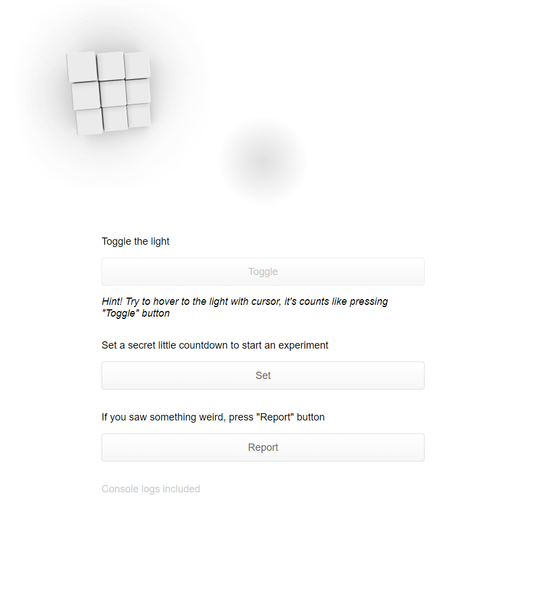

# Reverse-sense-of-time-experiment
## Simple apllication to test the sense of time

### Used native
- HTML  
- CSS  
- JS

## How to try
### Download
#### Variant 1
1. Click green "Code" button
2. Click Download ZIP
#### Variant 2
1. open cli
2. `git clone https://github.com/bakhtyiar/Reverse-sense-of-time-experiment.git`
### And open
3. In downloaded ZIP or folder, open index.html in "src" folder
